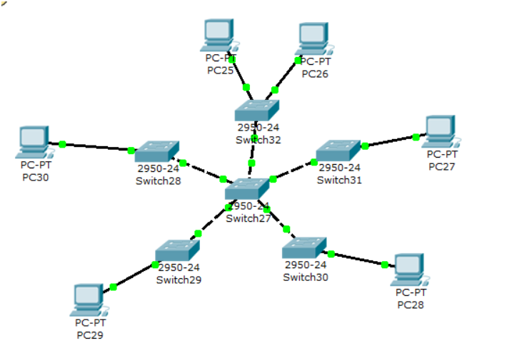
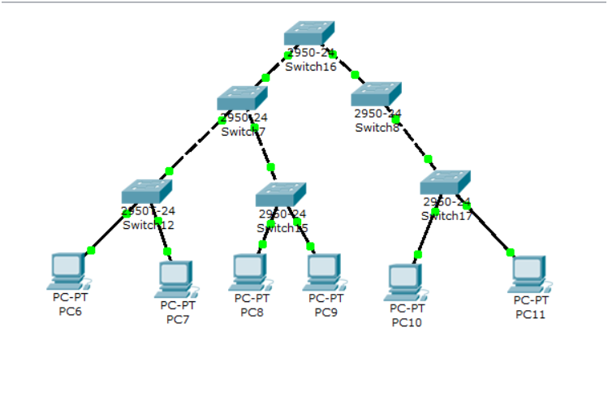

# 实验 1：VLAN 划分实验

本实验主要练习二层交换环境中的 VLAN 划分，理解 access 端口、trunk 端口、VLAN 标签和广播域隔离。

## 文件

- [1.pkt](<1.pkt>)：Packet Tracer 拓扑文件
- [课件](<计算机网络实验1  vlan划分实验.pptx>)：VLAN 原理和实验要求
- [assets](<assets/>)：配置过程和验证截图，共 8 张

## 拓扑与任务

课件要求完成星型网络和树型网络中的 VLAN 构造。核心现象是：

```text
同一 VLAN 内主机可以互通
不同 VLAN 主机在纯二层交换环境下不能互通
跨交换机传递多个 VLAN 时，上联口需要配置为 trunk
```

星型拓扑示例：



树型拓扑示例：



## 配置要点

交换机上先创建 VLAN，再把连接 PC 的端口加入对应 VLAN：

```bash
enable
configure terminal

vlan 10
exit
vlan 20
exit

interface fa0/1
switchport mode access
switchport access vlan 10
exit

interface fa0/2
switchport mode access
switchport access vlan 20
exit
```

交换机之间如果要同时承载多个 VLAN，需要把互联端口设为 trunk：

```bash
interface fa0/24
switchport mode trunk
exit
```

## 验证

1. 使用 `show vlan brief` 检查 VLAN 是否创建成功、端口是否加入正确 VLAN。
2. 同 VLAN 主机互 ping 应成功。
3. 不同 VLAN 主机互 ping 应失败，除非后续实验引入三层路由。
4. 如果跨交换机同 VLAN 不通，优先检查交换机互联口是否为 trunk。

## 报告截图建议

1. 星型或树型拓扑总览。
2. `show vlan brief` 的 VLAN 与端口归属。
3. trunk 端口配置或 `show interfaces trunk` 结果。
4. 同 VLAN ping 成功、不同 VLAN ping 失败的验证结果。
