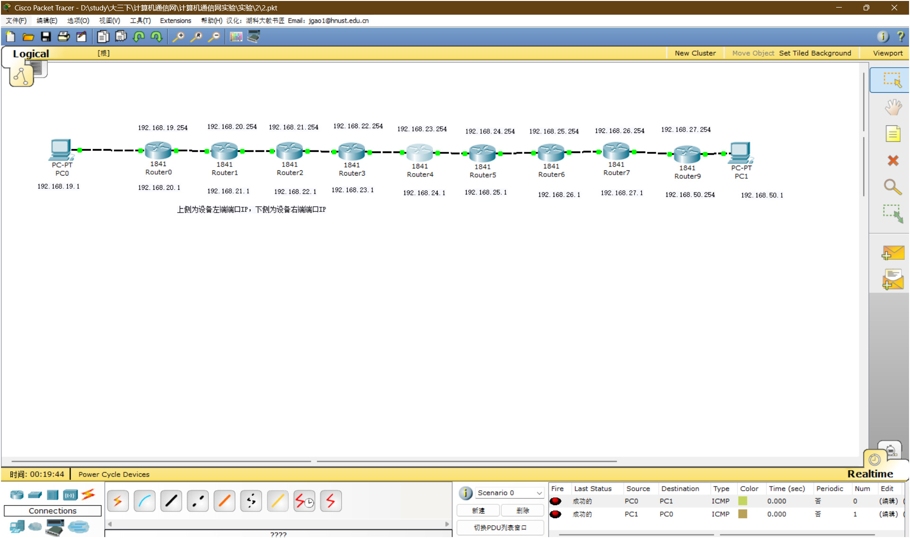

# 实验 2：路由基本概念及静态路由配置实验

本实验使用多台路由器串联，练习接口地址规划、PC 默认网关和静态路由配置。

## 文件

- [2.pkt](<2.pkt>)：Packet Tracer 拓扑文件
- [课件](<计算机网络实验2  路由基本概念及静态路由配置实验.ppt>)：路由基本概念和实验要求
- [assets](<assets/>)：配置过程、路由表和验证截图，共 10 张

## 拓扑

拓扑从 PC0 到 PC1 经过多台 1841 路由器，截图中按相邻链路规划了 `192.168.19.0/24` 到 `192.168.50.0/24` 等网段。



## 配置要点

每台路由器需要完成两类配置：

1. 给两侧直连接口配置 IP 地址并开启端口。
2. 为非直连网段添加静态路由。

接口配置示例：

```bash
enable
configure terminal

interface fa0/0
ip address 192.168.19.254 255.255.255.0
no shutdown
exit

interface fa0/1
ip address 192.168.20.1 255.255.255.0
no shutdown
exit
```

静态路由配置示例：

```bash
ip route 192.168.50.0 255.255.255.0 192.168.20.254
```

写静态路由时只记住一件事：目标网段是要去哪里，下一跳是从本路由器出发遇到的下一台路由器接口地址。

## 验证

1. PC0 默认网关填写左侧接入路由器接口地址，PC1 默认网关填写右侧接入路由器接口地址。
2. `show ip interface brief` 检查接口是否 up。
3. `show ip route` 检查远端网段是否出现在路由表中。
4. PC0 ping PC1、PC1 ping PC0 均应成功。

如果只单向通，通常是回程路由缺失。
