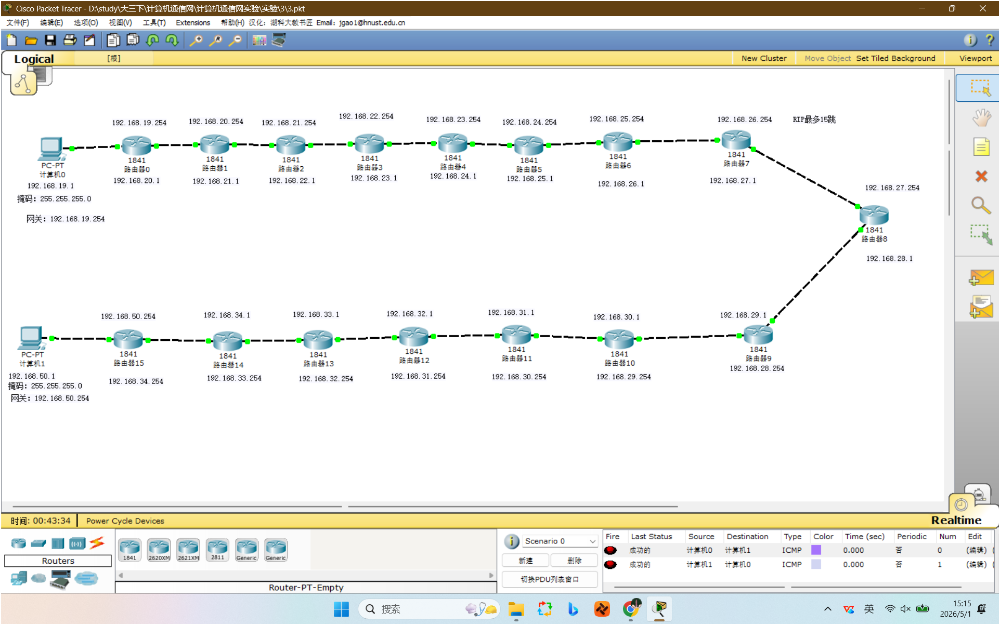
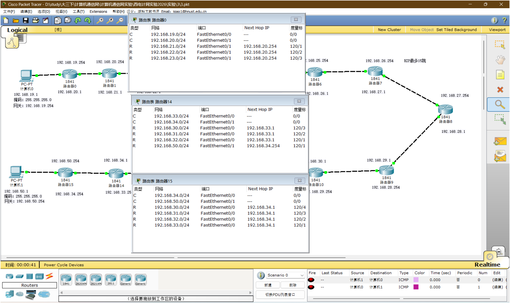

# 实验 3：RIP 协议原理及网络自愈实验

本实验练习动态路由协议 RIP 的基本配置，并观察链路断开后路由表的变化。

## 文件

- [3.pkt](<3.pkt>)：16 节点 RIP 总线拓扑
- [3.1.pkt](<3.1.pkt>)、[3.2.pkt](<3.2.pkt>)：补充拓扑
- [课件](<计算机网络实验3  RIP协议原理及网络自愈实验.pptx>)：RIP 原理、配置和实验要求
- [assets](<assets/>)：拓扑、路由表和验证截图，共 11 张

## 拓扑与任务

主要任务包括：

1. 使用 RIP 构造 16 个节点的总线型网络。
2. 截图标识整体地址规划。
3. 配置两个端点主机的 IP 和网关。
4. 验证端到端主机连通。
5. 观察 RIP 路由表的跳数。
6. 断开上分路，模拟链路故障并比较自愈前后的路由表。
7. 构造 17 个节点测试 RIP 最大 15 跳限制。

16 节点拓扑示例：



路由表对比示例：



## 配置要点

Packet Tracer 5.3 中可以在图形界面的 `Config -> RIP` 添加直连网络，也可以使用 CLI：

```bash
enable
configure terminal

router rip
network 192.168.19.0
network 192.168.20.0
exit
```

每台路由器只宣告自己的直连网段。不要把远端网段当成本机 network 命令写进去。

## 验证

1. `show ip route` 中 RIP 学到的路由会以 `R` 标识。
2. 度量值按跳数增加，RIP 最大有效跳数是 15。
3. 端到端 ping 成功后，断开备选拓扑中的一条链路，等待 RIP 更新，再观察路由表变化。
4. 17 节点边界测试中，如果端点超过 15 跳，RIP 会认为目标不可达。
