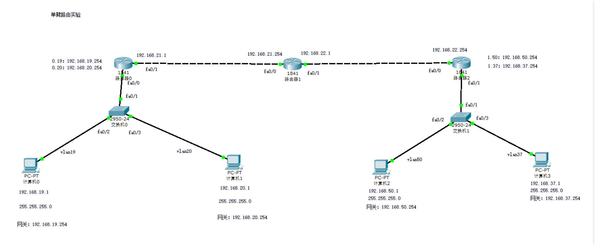

# 实验 4：单臂路由实验

本实验在左右两侧分别使用交换机和路由器子接口，实现不同 VLAN 之间的三层转发。

## 文件

- [4.pkt](<4.pkt>)：Packet Tracer 拓扑文件
- [课件](<计算机网络实验4  单臂路由实验.ppt>)：单臂路由实验要求
- [assets](<assets/>)：拓扑、子接口、路由和验证截图，共 12 张

## 拓扑

左侧包含 VLAN 19、VLAN 20，右侧包含 VLAN 50、VLAN 37，中间通过路由器互联。



## 地址规划

| 位置 | 地址 |
| --- | --- |
| PC0 | `192.168.19.1/24`，网关 `192.168.19.254` |
| PC1 | `192.168.20.1/24`，网关 `192.168.20.254` |
| Router0-Router1 | `192.168.21.1/24`、`192.168.21.254/24` |
| Router1-Router2 | `192.168.22.1/24`、`192.168.22.254/24` |
| PC2 | `192.168.50.1/24`，网关 `192.168.50.254` |
| PC3 | `192.168.37.1/24`，网关 `192.168.37.254` |

## 配置要点

交换机连接 PC 的端口设 access，连接路由器的端口设 trunk。路由器物理口只 `no shutdown`，网关地址配置在子接口上：

```bash
interface fa0/0
no shutdown
exit

interface fa0/0.19
encapsulation dot1Q 19
ip address 192.168.19.254 255.255.255.0
exit

interface fa0/0.20
encapsulation dot1Q 20
ip address 192.168.20.254 255.255.255.0
exit
```

跨路由器访问还需要补齐到远端网段的静态路由，或按教师要求使用动态路由。

## 验证

1. 同侧不同 VLAN 主机能通过单臂路由互通。
2. 左右两侧主机互通前，需要确认中间路由器的路由表完整。
3. `show interfaces trunk` 检查交换机上联口。
4. `show ip interface brief` 检查路由器子接口是否 up。
