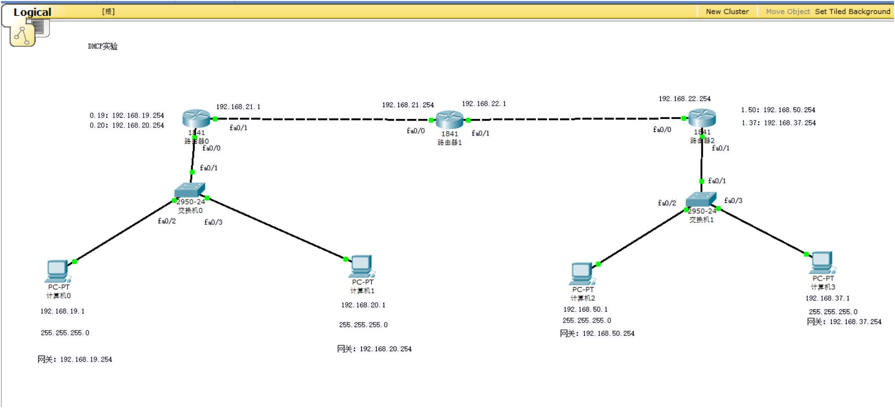

# 实验 5：DHCP 地址获取实验

本实验在单臂路由和多网段拓扑基础上配置 DHCP，使主机自动获取 IP 地址、掩码和默认网关。

## 文件

- [5.pkt](<5.pkt>)：Packet Tracer 拓扑文件
- [课件](<计算机网络实验5   DHCP地址获取实验.ppt>)：DHCP 地址获取实验要求
- [assets](<assets/>)：拓扑、DHCP 配置和地址获取截图，共 14 张

## 拓扑

拓扑沿用左右两侧 VLAN 网络，并在路由器上配置 DHCP 地址池。



## 配置要点

DHCP 地址池至少需要指定：

1. 地址池名称。
2. 可分配网段。
3. 默认网关。
4. 需要排除的网关地址或保留地址。

配置示例：

```bash
enable
configure terminal

ip dhcp excluded-address 192.168.19.254
ip dhcp pool VLAN19
network 192.168.19.0 255.255.255.0
default-router 192.168.19.254
exit
```

不同 VLAN 要分别创建地址池，`default-router` 必须写该 VLAN 的网关地址。

注意：`excluded-address` 建议先写在地址池外，避免网关地址被分配给 PC。跨路由器或跨 VLAN 获取 DHCP 时，还需要按题目确认是否需要 `ip helper-address`。

## 验证

1. PC 的 IP Configuration 选择 DHCP。
2. 获取到的 IP、掩码、网关应属于所在 VLAN。
3. 如果 PC 一直显示 DHCP request failed，检查交换机端口 VLAN、trunk、路由器子接口和 DHCP 地址池网段。
4. 获取地址后再执行 ping，验证同 VLAN、跨 VLAN 或跨路由器连通性。
