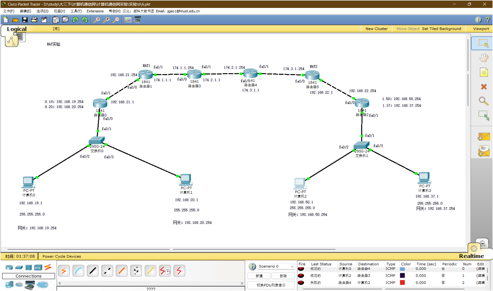

# 实验 6：NAT 配置实验

本实验在私网和公网混合拓扑中配置 NAT，理解 inside/outside 接口方向和地址转换表。

## 文件

- [6.pkt](<6.pkt>)：Packet Tracer 拓扑文件
- [6.1.pkt](<6.1.pkt>)：补充拓扑或实验过程版本
- [课件](<映射法扩充地址空间 NAT网络地址转换实验.pptx>)：NAT 网络地址转换实验要求
- [assets](<assets/>)：拓扑、接口地址、NAT 配置和验证截图，共 22 张

## 拓扑

左侧和右侧是私有地址网络，中间模拟公网链路。标注为 NAT1、NAT2 的路由器负责地址转换。



## 截图素材

实验 6 截图统一使用 `assets/exp06-NN.png` 命名，便于报告引用和后续补充。

| 范围 | 内容 |
| --- | --- |
| `exp06-01.png` - `exp06-13.png` | 地址配置、接口状态、NAT 配置和基础验证过程 |
| `exp06-14.png` | 完整拓扑图 |
| `exp06-15.png` - `exp06-16.png` | NAT 验证与结果截图 |
| `exp06-17.png` - `exp06-22.png` | 2026-05-16 补充的实验 6 过程和验证截图 |

## 地址线索

| 位置 | 地址 |
| --- | --- |
| 左侧 VLAN 19 | `192.168.19.0/24` |
| 左侧 VLAN 20 | `192.168.20.0/24` |
| 左侧 NAT 内侧链路 | `192.168.21.0/24` |
| 公网链路 1 | `174.1.0.0/16` |
| 公网链路 2 | `174.2.0.0/16` |
| 公网链路 3 | `174.3.0.0/16` |
| 右侧 NAT 内侧链路 | `192.168.22.0/24` |
| 右侧 VLAN 50 | `192.168.50.0/24` |
| 右侧 VLAN 37 | `192.168.37.0/24` |

## 配置要点

NAT 配置时先确定接口方向：

```text
私网侧接口：ip nat inside
公网侧接口：ip nat outside
```

静态 NAT 示例：

```bash
interface fa0/0
ip nat inside
exit

interface fa0/1
ip nat outside
exit

ip nat inside source static 192.168.19.1 174.1.1.1
```

如果实验要求多个内网地址共享一个公网地址，通常使用 PAT/overload；如果是一对一映射，则每台内网主机配置不同的 inside global 地址。

PAT/overload 示例：

```bash
access-list 1 permit 192.168.19.0 0.0.0.255
access-list 1 permit 192.168.20.0 0.0.0.255

interface fa0/0
ip nat inside
exit

interface fa0/1
ip nat outside
exit

ip nat inside source list 1 interface fa0/1 overload
```

## 验证

1. 私网主机访问公网或对端网络后，查看 `show ip nat translations`。
2. 如果路由可达但 NAT 不生效，优先检查 inside/outside 是否配反。
3. 如果 NAT 表有记录但端到端不通，检查公网段和回程路由。
4. 截图中的 PDU 结果显示成功和失败并存，说明 NAT、路由或访问策略需要分别定位。

## 排错顺序

1. `show ip interface brief` 确认 inside/outside 两侧接口 up/up。
2. `show ip route` 确认公网方向和回程方向都有路由。
3. `show running-config` 检查 `ip nat inside`、`ip nat outside` 和转换规则。
4. 从内网主机发起 ping 后再看 `show ip nat translations`，确认是否产生转换记录。
5. 如果有 ACL，先确认 ACL 没有提前拒绝 NAT 匹配流量。
