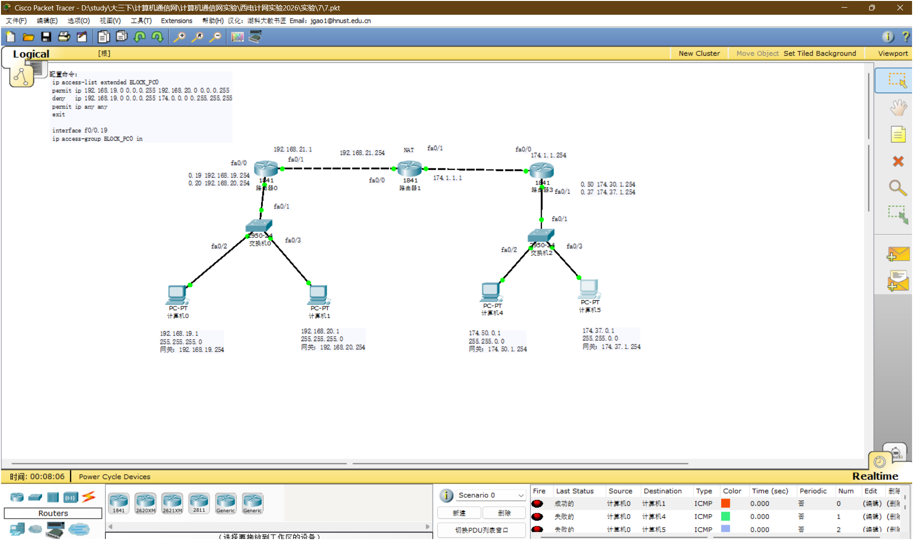
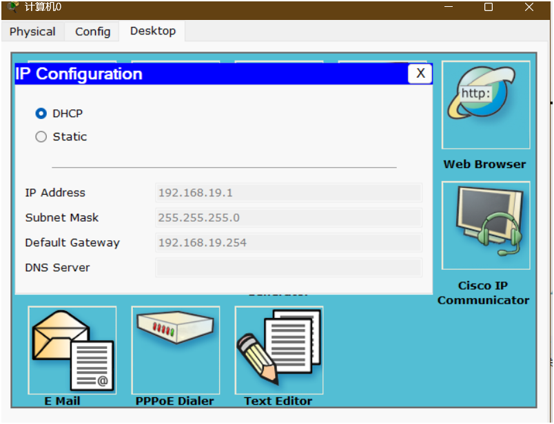
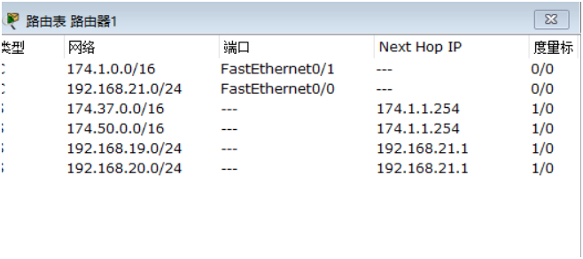
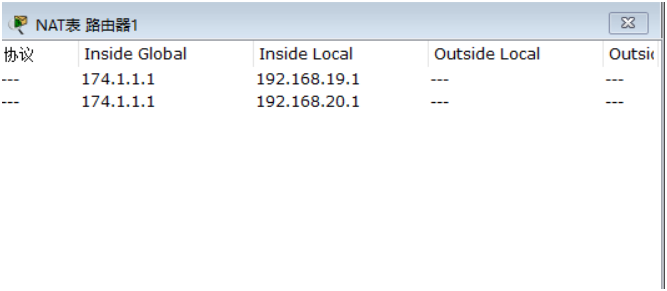
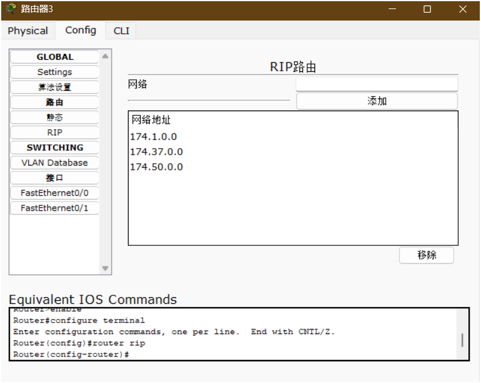

# 实验 7：单臂路由、NAT 与 ACL 配置梳理

> 这一章重点解决两个容易混乱的问题：单臂路由的物理链路/子接口怎么对应，以及 ACL 应该绑在 `in` 还是 `out` 方向。

## 文件

- [7.pkt](<7.pkt>)：Packet Tracer 拓扑文件
- [assets](<assets/>)：拓扑、地址获取、路由表、NAT 表和验证截图，共 7 张
- [exp07-flow.png](<assets/exp07-flow.png>)：PC0 发包路径和 ACL 绑定方向示意图

## 一、拓扑总览

本实验可以按三段看：

```text
左侧 VLAN 内网
PC0/PC1 -> Switch0 -> Router0

中间路由与 NAT
Router0 -> Router1(NAT) -> Router3

右侧 VLAN 网络
Router3 -> Switch2 -> PC4/PC5
```


Packet Tracer 拓扑截图：



## 二、地址与接口对应关系

| 设备 | 接口/位置 | 地址或 VLAN | 作用 |
| --- | --- | --- | --- |
| PC0 | 网卡 | `192.168.19.1/24`，网关 `192.168.19.254` | VLAN 19 主机 |
| PC1 | 网卡 | `192.168.20.1/24`，网关 `192.168.20.254` | VLAN 20 主机 |
| Switch0 | 连接 PC0 的口 | access VLAN 19 | 只承载 VLAN 19 |
| Switch0 | 连接 PC1 的口 | access VLAN 20 | 只承载 VLAN 20 |
| Switch0 | 连接 Router0 的口 | trunk | 同时承载 VLAN 19、VLAN 20 |
| Router0 | `fa0/0` | 不配 IP，`no shutdown` | 单臂路由物理口 |
| Router0 | `fa0/0.19` | `192.168.19.254/24` | VLAN 19 网关 |
| Router0 | `fa0/0.20` | `192.168.20.254/24` | VLAN 20 网关 |
| Router0 | `fa0/1` | `192.168.21.1/24` | 连接 Router1 |
| Router1 | `fa0/0` | `192.168.21.254/24` | 连接 Router0，NAT inside |
| Router1 | `fa0/1` | `174.1.1.1/16` | 连接 Router3，NAT outside |
| Router3 | `fa0/0` | `174.1.1.254/16` | 连接 Router1 |
| Router3 | `fa0/1` | 不配 IP，`no shutdown` | 右侧单臂路由物理口 |
| Router3 | `fa0/1.50` | `174.50.1.254/16` | VLAN 50 网关 |
| Router3 | `fa0/1.37` | `174.37.1.254/16` | VLAN 37 网关 |
| PC4 | 网卡 | `174.50.0.1/16`，网关 `174.50.1.254` | VLAN 50 主机 |
| PC5 | 网卡 | `174.37.0.1/16`，网关 `174.37.1.254` | VLAN 37 主机 |

PC0 的 DHCP 获取结果示例：



## 三、单臂路由怎么连

单臂路由不是“一个 VLAN 接一根路由器线”，而是：

```text
多台 PC 分别接交换机 access 口
交换机到路由器只用一根 trunk 线
路由器物理接口不配置 IP
路由器在这个物理接口下面开多个子接口
每个子接口对应一个 VLAN，并配置该 VLAN 的网关 IP
```

### 3.1 左侧 Router0 单臂路由

Switch0 上：

```bash
enable
configure terminal

vlan 19
exit
vlan 20
exit

interface fa0/2
switchport mode access
switchport access vlan 19
exit

interface fa0/3
switchport mode access
switchport access vlan 20
exit

interface fa0/1
switchport mode trunk
exit
```

Router0 上：

```bash
enable
configure terminal

interface fa0/0
no shutdown
exit

interface fa0/0.19
encapsulation dot1Q 19
ip address 192.168.19.254 255.255.255.0
exit

interface fa0/0.20
encapsulation dot1Q 20
ip address 192.168.20.254 255.255.255.0
exit

interface fa0/1
ip address 192.168.21.1 255.255.255.0
no shutdown
exit
```

要点：

- `fa0/0` 是物理口，只负责收发 trunk 帧，不能和子接口抢同一个网段地址。
- `fa0/0.19` 的 `.19` 只是子接口编号，通常写成 VLAN 号，关键命令是 `encapsulation dot1Q 19`。
- PC0 的默认网关必须填 `192.168.19.254`，PC1 的默认网关必须填 `192.168.20.254`。

### 3.2 右侧 Router3 单臂路由

Router3 到 Switch2 也一样，只是 VLAN 和地址换成 50、37：

```bash
interface fa0/1
no shutdown
exit

interface fa0/1.50
encapsulation dot1Q 50
ip address 174.50.1.254 255.255.0.0
exit

interface fa0/1.37
encapsulation dot1Q 37
ip address 174.37.1.254 255.255.0.0
exit
```

Switch2 上连接 Router3 的口设 trunk，连接 PC4、PC5 的口分别设 access VLAN 50、VLAN 37。

## 四、路由与 NAT

Router0 需要知道右侧网段走 Router1：

```bash
ip route 174.50.0.0 255.255.0.0 192.168.21.254
ip route 174.37.0.0 255.255.0.0 192.168.21.254
ip route 174.1.0.0 255.255.0.0 192.168.21.254
```

Router1 负责中间转发和 NAT。实验截图中 Router1 的路由表已经能看到左右两侧路由：



Router1 的 NAT 思路：

```bash
interface fa0/0
ip nat inside
exit

interface fa0/1
ip nat outside
exit

ip nat inside source static 192.168.19.1 174.1.1.1
ip nat inside source static 192.168.20.1 174.1.1.1
```

截图中的 NAT 表：



注意：严格的真实设备上，一个 inside global 地址通常不建议同时静态映射给两个 inside local 地址；Packet Tracer 实验有时为了验证现象会这样写。考试或报告里如果题目没有强制要求，更稳的是给不同内网主机分配不同 inside global，或者使用 PAT/overload。

Router3 可以用 RIP 宣告右侧网段，也可以按题目配置静态路由。截图中 Router3 使用 RIP 宣告了右侧三个网段：



## 五、ACL 放哪里，in/out 怎么判断

本实验目标从截图看是：

```text
允许 PC0 访问 PC1
禁止 PC0 访问右侧 174.0.0.0/8 网络
允许其他流量正常通过
```

对应 ACL：

```bash
ip access-list extended BLOCK_PC0
permit ip 192.168.19.0 0.0.0.255 192.168.20.0 0.0.0.255
deny ip 192.168.19.0 0.0.0.255 174.0.0.0 0.255.255.255
permit ip any any
exit
```

绑定位置：

```bash
interface fa0/0.19
ip access-group BLOCK_PC0 in
exit
```

### 为什么是 `fa0/0.19 in`

站在 Router0 的角度看：

```text
PC0 -> Switch0 -> Router0 fa0/0.19
```

PC0 发出的包是“进入 Router0 的 VLAN 19 子接口”，所以方向是 `in`。这样 ACL 在流量刚进入路由器时就处理，逻辑最直接。

如果把同一条 ACL 绑在 `fa0/1 out`，也能拦住去右侧的流量，但它只在离开 Router0 去 Router1 前生效；如果还要控制 PC0 到 PC1，就不适合放在 `fa0/1 out`，因为 PC0 到 PC1 的流量不会从 `fa0/1` 出去。

### in/out 判断口诀

```text
先选设备，再站在这个设备接口上看方向。
流量进入这个接口：in
流量离开这个接口：out
```

不要站在 PC 的视角判断 `in/out`，ACL 的方向永远是相对“被绑定的路由器接口”而言。

## 六、完整检查顺序

1. PC0、PC1、PC4、PC5 的 IP、掩码、网关是否正确。
2. 两台交换机是否创建对应 VLAN。
3. PC 接口是否为 access，并加入正确 VLAN。
4. 交换机上联路由器的接口是否为 trunk。
5. 路由器物理接口是否 `no shutdown`。
6. 子接口 `encapsulation dot1Q` 的 VLAN 号是否和交换机一致。
7. 子接口 IP 是否是该 VLAN 主机填写的默认网关。
8. `show ip route` 是否有左右两侧目标网段。
9. NAT 的 `inside/outside` 是否配反。
10. ACL 是否有最后的 `permit ip any any`。
11. ACL 方向是否站在绑定接口上判断。

常用命令：

```bash
show ip interface brief
show interfaces trunk
show vlan brief
show ip route
show ip nat translations
show access-lists
show running-config
```

## 七、验证现象

按截图中的 ACL，PC0 测试结果应表现为：

```text
PC0 -> PC1：允许
PC0 -> PC4：拒绝
PC0 -> PC5：拒绝
```

拓扑截图右下角的 PDU 列表正好对应这个结果：


