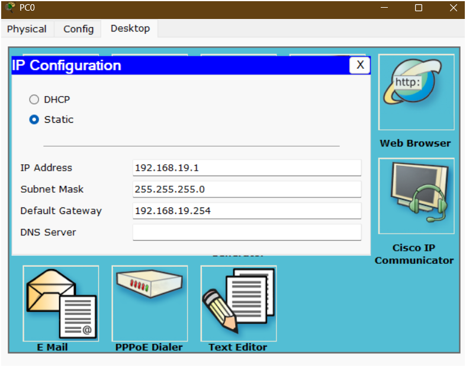
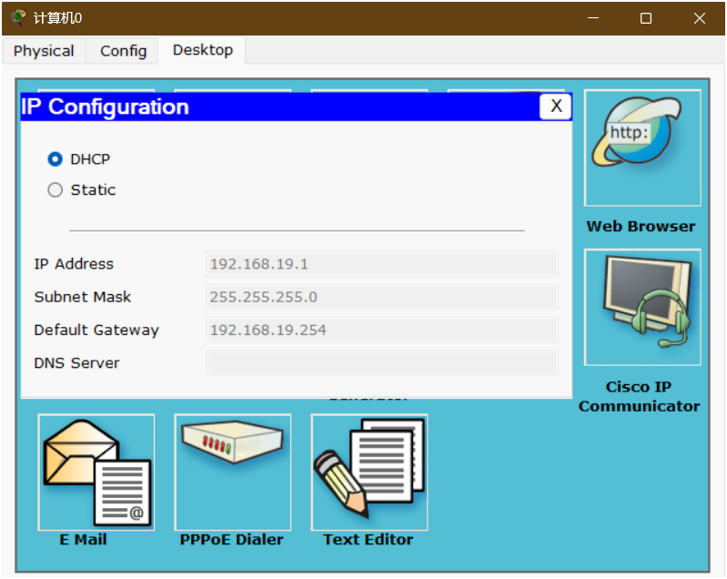
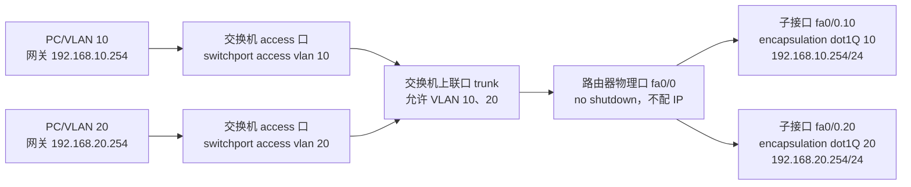
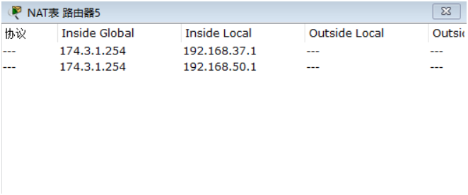

# 计网考试复习文档——jerryhuang

> 适用内容：单臂路由、VLAN、DHCP、NAT、ACL、静态路由、动态路由、直连路由  
> 建议用途：考试前复习、实验报告整理、Packet Tracer 配置检查

---

## 目录

1. [整体配置思路](#一整体配置思路)
2. [PC 主机 IP 配置](#二pc-主机-ip-配置)
3. [交换机 VLAN 与接口配置](#三交换机-vlan-与接口配置)
4. [单臂路由配置](#四单臂路由配置)
5. [DHCP 配置](#五dhcp-配置)
6. [NAT 配置](#六nat-配置)
7. [ACL 配置](#七acl-配置)
8. [路由配置](#八路由配置)
9. [常用检查命令](#九常用检查命令)
10. [考试排错顺序](#十考试排错顺序)

---

# 一、整体配置思路

一个完整实验一般按照下面顺序完成：

```text
PC 配 IP / DHCP
      ↓
交换机划分 VLAN
      ↓
交换机接口设置 Access / Trunk
      ↓
路由器配置单臂路由
      ↓
配置 DHCP
      ↓
配置静态路由 / RIP 动态路由
      ↓
配置 NAT
      ↓
配置 ACL
      ↓
ping / show 命令检查
```

---

# 二、PC 主机 IP 配置

## 2.1 静态 IP 配置

进入：

```text
PC → Desktop → IP Configuration → Static
```

填写：

```text
IP Address      192.168.1.X
Subnet Mask     255.255.255.0
Default Gateway 192.168.1.254
DNS Server      可不填，或按题目要求填写
```

📌 **贴图位置 1：PC 静态 IP 配置界面截图**




---

## 2.2 DHCP 自动获取 IP

进入：

```text
PC → Desktop → IP Configuration → DHCP
```

如果 DHCP 配置正确，PC 会自动获得：

```text
IP Address
Subnet Mask
Default Gateway
DNS Server
```

📌 **贴图位置 2：PC DHCP 获取 IP 界面截图**




---

# 三、交换机 VLAN 与接口配置

## 3.1 创建 VLAN

```bash
enable
configure terminal

vlan 10
name VLAN10
exit
```

如果有多个 VLAN，例如 VLAN 10、VLAN 20：

```bash
vlan 10
name VLAN10
exit

vlan 20
name VLAN20
exit
```


---

## 3.2 Access 接口配置

Access 接口一般连接 PC。

例如：把交换机 `f0/1` 加入 VLAN 10：

```bash
interface f0/1
switchport mode access
switchport access vlan 10
exit
```

如果 PC 接在 `f0/2`，属于 VLAN 20：

```bash
interface f0/2
switchport mode access
switchport access vlan 20
exit
```


---

## 3.3 Trunk 接口配置

Trunk 接口一般连接路由器，用于单臂路由。

例如：交换机 `f0/24` 连接路由器：

```bash
interface f0/24
switchport mode trunk
exit
```

如果 Packet Tracer 不支持该命令，可以尝试：

```bash
interface f0/24
switchport mode trunk
switchport trunk allowed vlan all
exit
```


---

# 四、单臂路由配置

## 4.1 单臂路由作用

单臂路由用于实现不同 VLAN 之间通信。

核心点：

```text
交换机到路由器只用一根线
交换机这一端配置 trunk
路由器物理接口不配 IP，只 no shutdown
路由器物理接口下面开多个子接口
每个子接口对应一个 VLAN
每个子接口配置该 VLAN 的默认网关 IP
```

---

## 4.2 单臂路由链路流程



看包的过程：

```text
同 VLAN 通信：PC -> 交换机二层转发 -> 目标 PC
跨 VLAN 通信：PC -> access 口 -> trunk -> 路由器对应子接口 -> 路由 -> 另一个子接口 -> trunk -> 目标 VLAN
```

---

## 4.3 交换机配置

```bash
enable
configure terminal

vlan 10
exit
vlan 20
exit

interface f0/1
switchport mode access
switchport access vlan 10
exit

interface f0/2
switchport mode access
switchport access vlan 20
exit

interface f0/24
switchport mode trunk
exit
```

说明：

```text
连接 PC 的接口：access
连接路由器的接口：trunk
```

---

## 4.4 路由器子接口配置

假设：

```text
VLAN 10：192.168.10.0/24，网关 192.168.10.254
VLAN 20：192.168.20.0/24，网关 192.168.20.254
```

配置：

```bash
interface f0/0
no shutdown
exit

interface f0/0.10
encapsulation dot1Q 10
ip address 192.168.10.254 255.255.255.0
exit

interface f0/0.20
encapsulation dot1Q 20
ip address 192.168.20.254 255.255.255.0
exit
```

说明：

```text
f0/0 是物理接口，只打开，不配网关 IP。
f0/0.10 是 VLAN 10 的三层网关。
f0/0.20 是 VLAN 20 的三层网关。
encapsulation dot1Q 后面的 VLAN 号必须和交换机 VLAN 一致。
PC 的默认网关必须填自己 VLAN 对应的子接口 IP。
```

---

## 4.5 实验 7 对应关系

```text
PC0：192.168.19.1/24，网关 192.168.19.254
PC1：192.168.20.1/24，网关 192.168.20.254
Router0 fa0/0：物理口，不配 IP，no shutdown
Router0 fa0/0.19：encapsulation dot1Q 19，IP 192.168.19.254/24
Router0 fa0/0.20：encapsulation dot1Q 20，IP 192.168.20.254/24
```

实验 7 右侧也是单臂路由：

```text
PC4：174.50.0.1/16，网关 174.50.1.254
PC5：174.37.0.1/16，网关 174.37.1.254
Router3 fa0/1：物理口，不配 IP，no shutdown
Router3 fa0/1.50：encapsulation dot1Q 50，IP 174.50.1.254/16
Router3 fa0/1.37：encapsulation dot1Q 37，IP 174.37.1.254/16
```

---

## 4.6 检查单臂路由

```bash
show ip interface brief
show running-config
```

重点看：

```text
f0/0        up/up
f0/0.10     up/up
f0/0.20     up/up
```

如果子接口 down，通常检查：

```text
1. 路由器物理接口是否 no shutdown
2. 交换机连接路由器的接口是否为 trunk
3. 子接口 VLAN ID 是否与交换机 VLAN 一致
4. PC 网关是否填成对应子接口 IP
```

---

# 五、DHCP 配置

## 5.1 DHCP 作用

DHCP 用于自动给 PC 分配：

```text
IP 地址
子网掩码
默认网关
DNS
```

---

## 5.2 单网段 DHCP 配置

以 `192.168.1.0/24` 为例：

```bash
enable
configure terminal

ip dhcp pool zs
network 192.168.1.0 255.255.255.0
default-router 192.168.1.254
ip dhcp excluded-address 192.168.1.254
exit
```

说明：

```text
ip dhcp pool zs
表示创建名为 zs 的地址池。

network 192.168.1.0 255.255.255.0
表示可分配地址所在网段。

default-router 192.168.1.254
表示给 PC 下发默认网关。

ip dhcp excluded-address 192.168.1.254
表示排除网关地址，避免分配给 PC。
```

---

## 5.3 多 VLAN DHCP 配置

如果有 VLAN 10 和 VLAN 20：

```bash
ip dhcp pool vlan10
network 192.168.10.0 255.255.255.0
default-router 192.168.10.254
ip dhcp excluded-address 192.168.10.254
exit

ip dhcp pool vlan20
network 192.168.20.0 255.255.255.0
default-router 192.168.20.254
ip dhcp excluded-address 192.168.20.254
exit
```

---

## 5.4 检查 DHCP

```bash
show ip dhcp binding
show ip dhcp pool
```


# 六、NAT 配置

## 6.1 NAT 作用

NAT 用于让内网地址访问外网。

常见方向：

```text
内网接口：ip nat inside
外网接口：ip nat outside
```

---

## 6.2 静态 NAT

静态 NAT 是一对一映射。

例如：

```text
内网主机：192.168.19.1 192.168.20.1
外网地址：60.0.0.10
```

配置：

```bash
interface f0/0
ip nat inside
exit

interface f0/1
ip nat outside
exit

ip nat inside source static 192.168.19.1 60.0.0.10
ip nat inside source static 192.168.20.1 60.0.0.10
```

---

## 6.3 动态 NAT

动态 NAT 使用地址池。

```bash
access-list 1 permit 192.168.1.0 0.0.0.255

ip nat pool NATPOOL 60.0.0.10 60.0.0.20 netmask 255.255.255.0

ip nat inside source list 1 pool NATPOOL
```

---

## 6.4 PAT / NAT Overload

如果多个内网主机共用一个外网接口地址，使用 overload。

```bash
access-list 1 permit 192.168.1.0 0.0.0.255

interface f0/0
ip nat inside
exit

interface f0/1
ip nat outside
exit

ip nat inside source list 1 interface f0/1 overload
```

---

## 6.5 检查 NAT

```bash
show ip nat translations
show ip nat statistics
```

如果 NAT 不通，优先检查：

```text
1. inside 和 outside 有没有配反
2. ACL 是否允许了内网网段
3. 外网方向是否有路由
4. 对端是否有返回路由
5. 是否产生 NAT 转换表
```


---



------

# 七、ACL 配置

## 7.1 ACL 作用

ACL 用于控制流量是否允许通过。

常见类型：

```text
标准 ACL：只看源 IP
扩展 ACL：看源 IP、目的 IP、协议、端口
```

---

## 7.2 标准 ACL

禁止 `192.168.1.0/24`，允许其他所有：

```bash
ip access-list standard zs
deny 192.168.1.0 0.0.0.255
permit any
exit
```

应用到接口：

```bash
interface f0/0.1
ip access-group zs out
exit
```

检查：

```bash
show ip access-lists
show running-config
```

---

## 7.3 标准 ACL 注意点

```text
标准 ACL 只检查源 IP。
标准 ACL 一般放在靠近目的端的位置。
ACL 最后默认有一条 deny any。
所以如果写了 deny，一般还要写 permit any。
```

---

## 7.4 扩展 ACL 示例

禁止 192.168.1.0/24 访问 192.168.2.0/24：

```bash
access-list 100 deny ip 192.168.1.0 0.0.0.255 192.168.2.0 0.0.0.255
access-list 100 permit ip any any
```

应用：

```bash
interface f0/0
ip access-group 100 in
exit
```

---

## 7.5 ACL 的 in / out 判断

ACL 方向永远是站在“绑定 ACL 的路由器接口”上判断，不是站在 PC 上判断。

```text
流量进入这个接口：in
流量离开这个接口：out
```

例子：PC0 在 VLAN 19，流量从 PC0 发往外部时：

```text
PC0 -> 交换机 access 口 -> trunk -> Router0 fa0/0.19
```

站在 Router0 的 `fa0/0.19` 子接口看，PC0 的流量是进入该接口，所以应该写：

```bash
interface fa0/0.19
ip access-group BLOCK_PC0 in
exit
```

如果同一条 ACL 绑在 Router0 的外联口 `fa0/1 out`，它只能控制从 Router0 发往 Router1 的流量；PC0 到 PC1 的跨 VLAN 流量不会从 `fa0/1` 出去，所以不能用这个位置控制 PC0 到 PC1。

---

## 7.6 实验 7 ACL 写法

目标：

```text
允许 PC0 所在 192.168.19.0/24 访问 PC1 所在 192.168.20.0/24
禁止 PC0 所在 192.168.19.0/24 访问右侧 174.0.0.0/8
允许其他流量
```

配置：

```bash
ip access-list extended BLOCK_PC0
permit ip 192.168.19.0 0.0.0.255 192.168.20.0 0.0.0.255
deny ip 192.168.19.0 0.0.0.255 174.0.0.0 0.255.255.255
permit ip any any
exit

interface fa0/0.19
ip access-group BLOCK_PC0 in
exit
```

判断结果：

```text
PC0 -> PC1：允许
PC0 -> 174.50.0.1：拒绝
PC0 -> 174.37.0.1：拒绝
```

---

# 八、路由配置

## 8.1 直连路由

直连路由不需要手动配置。

只要接口配置了 IP，并且接口是 up/up，路由表中就会自动出现。

检查命令：

```bash
show ip route
```

直连路由标志：

```text
C    connected
L    local
```


---

## 8.2 静态路由

格式：

```bash
ip route 目标网段 子网掩码 下一跳地址
```

示例：

```bash
ip route 192.168.2.0 255.255.255.0 10.0.0.2
```

默认路由：

```bash
ip route 0.0.0.0 0.0.0.0 下一跳地址
```

示例：

```bash
ip route 0.0.0.0 0.0.0.0 60.0.0.1
```

---

## 8.3 RIP 动态路由

基本配置：

```bash
router rip
version 2
network 192.168.1.0
network 10.0.0.0
no auto-summary
exit
```

说明：

```text
router rip        进入 RIP 配置
version 2         使用 RIPv2
network           宣告直连网段
no auto-summary   关闭自动汇总
```

检查：

```bash
show ip route
show ip protocols
```

RIP 路由标志：

```text
R    RIP learned route
```


---

# 九、常用检查命令

## 9.1 查看接口状态

```bash
show ip interface brief
```

重点看：

```text
Status      Protocol
up          up
```

---

## 9.2 查看路由表

```bash
show ip route
```

重点看是否有：

```text
C 直连路由
S 静态路由
R RIP 路由
```

---

## 9.3 查看运行配置

```bash
show running-config
```

---

## 9.4 查看 NAT

```bash
show ip nat translations
show ip nat statistics
```

---

## 9.5 查看 ACL

```bash
show access-lists
show ip access-lists
```

---

## 9.6 测试连通性

```bash
ping 目标IP
tracert 目标IP
```

---

# 十、考试排错顺序

考试排错不要乱看，按下面顺序来：

```text
第一步：看 PC 的 IP、掩码、网关
第二步：看交换机 VLAN 是否正确
第三步：看接口是 Access 还是 Trunk
第四步：看路由器子接口 dot1Q 是否正确
第五步：看接口是否 up/up
第六步：看路由表是否有目标网段
第七步：看 NAT inside/outside 是否正确
第八步：看 ACL 有没有误拦截
第九步：ping 网关
第十步：ping 远端主机
```

---

# 十一、常见错误总结

| 错误现象 | 可能原因 |
|---|---|
| PC ping 不通网关 | IP、网关、VLAN、Access 口错误 |
| VLAN 间不通 | 单臂路由子接口错误，或 Trunk 没开 |
| DHCP 获取不到地址 | DHCP 地址池错误，网关未排除，接口未 up |
| 内网能通，外网不通 | NAT、默认路由、返回路由错误 |
| NAT 没转换记录 | inside/outside 配错，ACL 没匹配 |
| RIP 学不到路由 | network 宣告错误，no auto-summary 没配 |
| 配了 ACL 后全不通 | 忘记 permit any，或方向 in/out 错误 |

---

# 十二、考试记忆口诀

```text
先主机，后交换；
先 VLAN，后 Trunk；
先网关，后路由；
先 inside，后 outside；
先放行，后限制；
先 show，再 ping。
```

---

# 十三、最小完整配置模板

下面是一套可以直接套用的基础模板。

## 13.1 交换机

```bash
enable
configure terminal

vlan 10
name VLAN10
exit

interface f0/1
switchport mode access
switchport access vlan 10
exit

interface f0/24
switchport mode trunk
exit
```

---

## 13.2 路由器单臂路由 + DHCP

```bash
enable
configure terminal

interface f0/0
no shutdown
exit

interface f0/0.10
encapsulation dot1Q 10
ip address 192.168.1.254 255.255.255.0
exit

ip dhcp excluded-address 192.168.1.254

ip dhcp pool zs
network 192.168.1.0 255.255.255.0
default-router 192.168.1.254
exit
```

---

## 13.3 NAT Overload

```bash
access-list 1 permit 192.168.1.0 0.0.0.255

interface f0/0.10
ip nat inside
exit

interface f0/1
ip nat outside
exit

ip nat inside source list 1 interface f0/1 overload
```

---

## 13.4 默认路由

```bash
ip route 0.0.0.0 0.0.0.0 下一跳地址
```

---

## 13.5 RIP

```bash
router rip
version 2
network 192.168.1.0
network 10.0.0.0
no auto-summary
exit
```

---

# 十四、最后检查清单

考试交卷前检查：

```text
[ ] PC 是否有正确 IP
[ ] PC 默认网关是否正确
[ ] VLAN 是否创建
[ ] PC 接口是否加入正确 VLAN
[ ] 路由器连接交换机的接口是否为 trunk
[ ] 子接口 dot1Q VLAN 号是否正确
[ ] 子接口 IP 是否为对应网关
[ ] DHCP 是否排除了网关地址
[ ] NAT inside/outside 是否正确
[ ] 静态路由或 RIP 是否完整
[ ] ACL 是否有 permit any
[ ] show ip route 是否有目标路由
[ ] show ip nat translations 是否有转换记录
[ ] ping 是否逐跳测试成功
```
